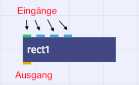

# Grundlagen

*Die grundlegende Konzepte hinter Nodebox.live*

- Screenshot

## Ein- und Ausgänge der Knoten

- Jeder Knoten in Nodebox verarbeitet die Inputwerte um einen Output zu erzeugen.

- Alle Eingang-Ports in Nodebox erwarten bestimmte Arten. Und jeder Ausgang-Port erzeugt einen bestimmten Wert. Wenn wir über eine Eingang oder Ausgang mit der Maus verweilen erfahren wir welche welche Art Nodebox erwartet:

- 
- Außerdem sind üblicherweise die Ports dafür auch in verschieden Farben aufgeteilt:

---

-  `Nummern` sind sowohl ganzzahlige werte `integer` (zb. 1 / 5 / 72 usw.)   
als auch Zahlen mit nachkomma stellen `float` (z.B 0.25 / 1.678 / 3.333 usw.)

	- `float`werden benutzt um um z.B die breite/höhe eine Objekts zu verändern.
	- `integer` werden benutzt um Mengen anzugeben also z.B. 10 Kopien im `copy` Knoten

-  `Points` (Punkte) sind zwei dimensionale Koordinaten die `X` und `Y` koordinaten enthalten.
	- Sie können benutzt werden um ein Ort zu bestimmen z.B die position eines Rechtecks, die Skalierung im `scale` Knoten oder den dreh und Angelpunkt eins `rotate` Knoten (also den Punkt um den rotiert werden soll)
-  `Shapes` (Formen) enthalten Informationen über kurven, Linien und Punkte.
-  `Strings` (Zeichenketten) enthalten reinen Text.
	- In der Regel der text in dem `textpath` Knoten.
-  `Listen` sind Sammlungen und können deshalb mehrere `Nummern` `Points`, `Shapes` und `Colors` Enthalten.
	- Deshalb können sie auch mit Eingängen Verbunden werden die einen anderen Typ erwarten. d.H so lange die Liste aus Zahlen besteht kann sie auch mit dem  `Nummern` Eingang verbunden werden.

-  `Colors` enthalten Farbwerte in der Form von red/green/blue/alpha (`rgbColor`) oder hue/saturation/brightness/alpha (`hsbColor`) werten.
	- Sie werden benutzt um Farbwerte zu definieren: z.B die Füllfarbe eines Objekts oder die Kontur einer Linie

---
