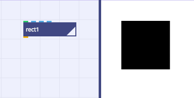
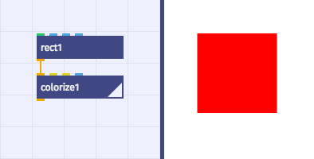
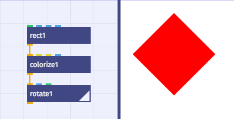
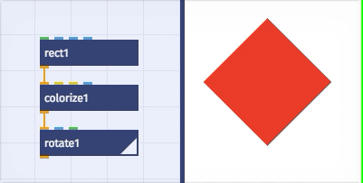

# Grundlagen

*Die grundlegende Konzepte hinter Nodebox.live*

## Nodebox als Fließband

## Knoten

Wenn wir Knoten miteinander verbinden entsteht eine art Fließband bei der die informationen an jeden einzenen Arbeiter (also Knoten) weitergeben werden um Formen zu erzeugen und zu verändern.

### Beispiel:

1. Erstellen wir einen `rect` Knoten.

	

2. Verbinden wir einen `Colorize` Knoten mit dem `rect` Knoten. Er verändert den Output und färbt ihn ein.

  

3. Anschließend fügen wir einen `rotate` Knoten hinzu. Er nimmt den output und rotiert ihn.

   

Wir Können jeden einezelnen Schritt nachvolziehen indem wir mit einem Doppelklick den aktiven Knoten (Render-Knoten) wechseln:

## Ein- und Ausgänge

- Jeder Knoten verarbeitet ein oder mehrere Eingaben (Inputs) um eine Ausgabe (Output) zu erzeugen.

  
  
- Alle Eingang-Ports in Nodebox erwarten Input eines bestimmten Typs. Jeder Ausgang-Port erzeugt einen Output eines bestimmten Typs. 
- Wenn man über einem Eingangs mit der Maus verweilt sieht man welchen Datentypen der Knoten an diesem Port erwartet. 
- Wenn man über dem Ausgang mit der Maus verweilt sieht man welchen Datentyp der Output des Knotens hat.

  

## Datentypen

Die Datentypen an den Ports werden in der Regel durch Farben codiert:

### Zahlen

-  `Nummern` sind sowohl ganzzahlige werte `integer` (zb. 1 / 5 / 72 usw.)   
als auch Zahlen mit nachkomma stellen `float` (z.B 0.25 / 1.678 / 3.333 usw.)

	- `float`werden benutzt um um z.B die breite/höhe eine Objekts zu verändern.
	- `integer` werden benutzt um Mengen anzugeben also z.B. 10 Kopien im `copy` Knoten

### Points

-  `Points` (Punkte) sind zwei dimensionale Koordinaten die `X` und `Y` koordinaten enthalten.
	- Sie können benutzt werden um ein Ort zu bestimmen z.B die position eines Rechtecks, die Skalierung im `scale` Knoten oder den dreh und Angelpunkt eins `rotate` Knoten (also den Punkt um den rotiert werden soll)

### Shapes

-  `Shapes` (Formen) enthalten Informationen über Kurven, Linien und Punkte.

### Strings
-  `Strings` (Zeichenketten) enthalten reinen Text.
	- In der Regel der text in dem `textpath` Knoten.

### Listen

-  `Listen` sind Sammlungen und können deshalb mehrere `Nummern` `Points`, `Shapes` und `Colors` Enthalten.
	- Deshalb können sie auch mit Eingängen Verbunden werden die einen anderen Typ erwarten. d.H so lange die Liste aus Zahlen besteht kann sie auch mit dem  `Nummern` Eingang verbunden werden.

### Farben
-  `Colors` enthalten Farbwerte in der Form von red/green/blue/alpha (`rgbColor`) oder hue/saturation/brightness/alpha (`hsbColor`) werten.
	- Sie werden benutzt um Farbwerte zu definieren: z.B die Füllfarbe eines Objekts oder die Kontur einer Linie
