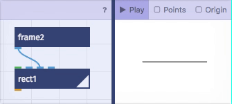

# Bewegung

*Animationen fürs Web und Animierte Gifs mit Nodebox.live*

## So geht's

- Screenshot Interface
- Animation abspielen
- Export als animiertes GIF

## Animations-Knoten

- Frame-basiert vs. Echtzeit
   - Aktueller Frame: `frame`
   - Sekunden seit Start:`eleapsedSeconds`

Der `frame` Knoten kann benutzt werden um nahezu alle Parameter in Nodebox zu animieren. Wenn wir auf den `play` Knopf drücken erhalten wir einfach den aktuellen Frame als Zahl:

 

 Verbinden wir diese Zahl z.B. mit dem `width` Eingang eines `rect` Knotens wächst dieser in die Unendlichkeit:

 Um die Geschwindigkeit und den Verlauf der Animation zu bestimmen, können wir die Zahl aus dem `frame` Knoten mit anderen Funktionen manipulieren. Oft benutzen wir dazu `multiply`, `divide`, `mod`, `convert` und die Wellenfunktionen.

 - Wenn wir z.B. die Zahl aus dem `frame` Knoten erst mit dem `divide` Knoten durch drei Teilen ist unsere Animation nur noch ein drittel so schnell wie oben:

 

 - der `mod` Knoten dividiert eine Zahl durch eine andere, aber nur der "Rest" bleibt als Ergebnis:
    - 4 : 5 = 0 und Rest ist 4 ==> also ist 4 das Ergebnis
    - 5 : 5 = 1 und Rest ist 0
    - 6 : 5 = 1 und Rest ist 1

    >ist mod als Konzept nützlich?
    >oder doch lieber die Sägezahn Funktion benutzen?

#### Wellenfuntionen:
  - Der `sineWave` Knoten erzeugt eine Sinus Welle und ermöglicht uns so wiederholende und "weiche" Animationen. Die Animation fängt langsam an wird schneller und bremst gegen Ende wieder ab. In AfterEffects lässt sich über `Easy-Ease` ein ähnlicher Effekt erreichen.

Eingänge | Erklärung
------------ | -------------
v | hier kommt unser `frame` als Eingang
min | der niedrigste Wert den wir als Ausgang benötigen
max | der höchste Wert
period | die Anzahl an Frames bis sich die Animation wiederholen soll
offset | Hier können wir den den Startpunkt verschieben (in diesem Fall nicht notwendig).

  - Dreieck
  - Sägezahn
  - Rechteck

## Gotchas

<<<<<<< HEAD
<<<<<<< HEAD
- Für zyklische GIFs muss die Phase muss ein Teiler der Framezahl sein.
- bei 100 Frames z.B. 50, 33, 25, 20, 10 oder 5.
=======
=======
>>>>>>> c61a03ba9a82f539dc4317f550e9ac9787433dd7
- Für zyklische GIFs muss die Phase ein Teiler der Framezahl sein.
- bei 100 Frames z.B. 50, 33, 25, 20, 10 oder 5. 
>>>>>>> c61a03ba9a82f539dc4317f550e9ac9787433dd7
