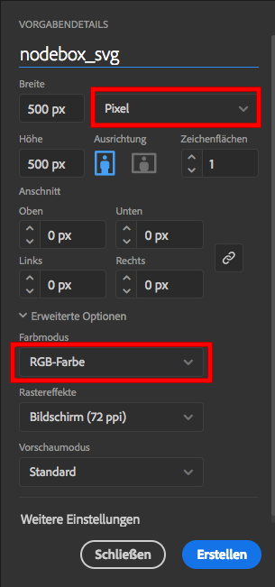
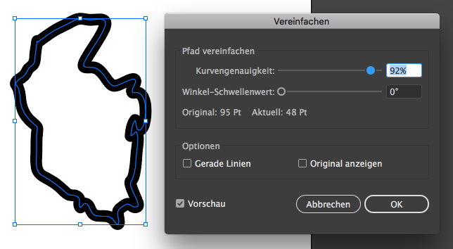
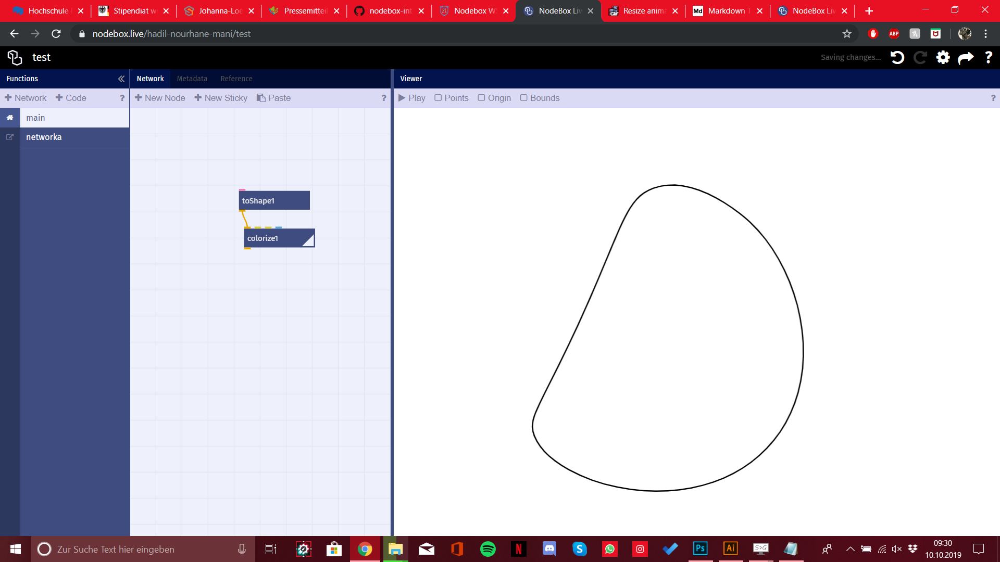
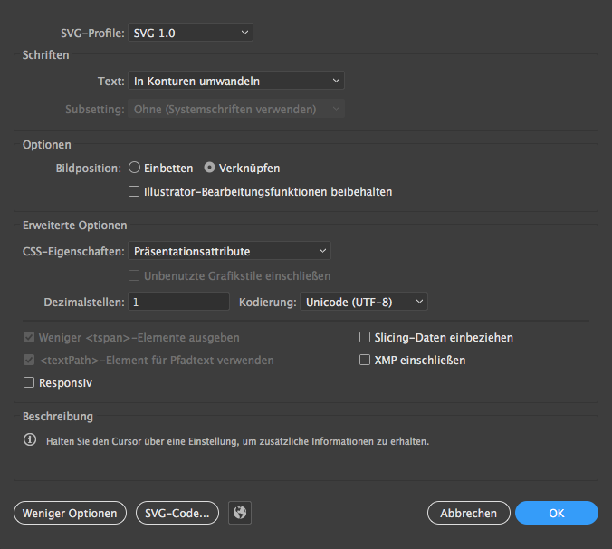

# Import-Export

Vektor-Grafiken, Fonts und Bitmaps laden und speichern

## SVGs, Fonts und Grafiken importieren

- Copyright beachten!!!
- NUR freie Schriften, selbst gestaltete Fonts, SVGs oder Photos
- kleine Filegrössen
- Screenshot
- Schritt-für-Schritt-Anleitung

## SVGs aus Illustrator

### vor dem Export:

- Um zu vermeiden, dass irgentwelche unerwünschten Pfade im svg landen, starten wir zuerst mit einer neuen Datei. Dabei ist zu achten, dass die Datei in Pixeln und im RGB Modus ist:

	

- Nodebox kann nicht mit außergwählich großen Dateien umgehen. Am einfachsten können wir deswegen unsere Zeichnung mit `Objekt > Pfad > vereinfachen…` reduzieren.

	
	
- ...

	
	
	
	
- ...

	
	
	
	
- ...

	
	
	
	

	

### Export

- `Datei > Speicher unter…` um SVGs zu exportieren
- Im nächsten Fenster bei Format `SVG (svg)` auswählen. Und __kein__ Haken bei "Zeichenflächen benutzen" setzen
- Im Nächsten Fenster ist besonder `SVG 1.0` wichtig. Eventuell müssen auch die anderen Einstellungen angepasst werden.

	
- Wir gross ist das File?
- ggf. [Pfade in Illustrator vereinfachen](#vor-dem-export)

- Gotchas
	- SVG-Probleme mit Nodebox
	- Filesize Limit
	- Lösungs-Ansätze
		- SVG-Cleaner Software?
		- Shapes etwas drehen

# Assets aus dem Netz laden

- Etwa für Live-Datenvisualisierung
- Mit Javascript möglich
- Siehe auch `net` library

## Animierte Gifs exportieren

- Frames
- Größe
- Weiterverarbeiten
- Verbreiten und teilen

## SVGs exportieren

-  Screenshot

## Fonts exportieren

-  Theoretisch möglich dank opentype.js
-  Coming soon ...
